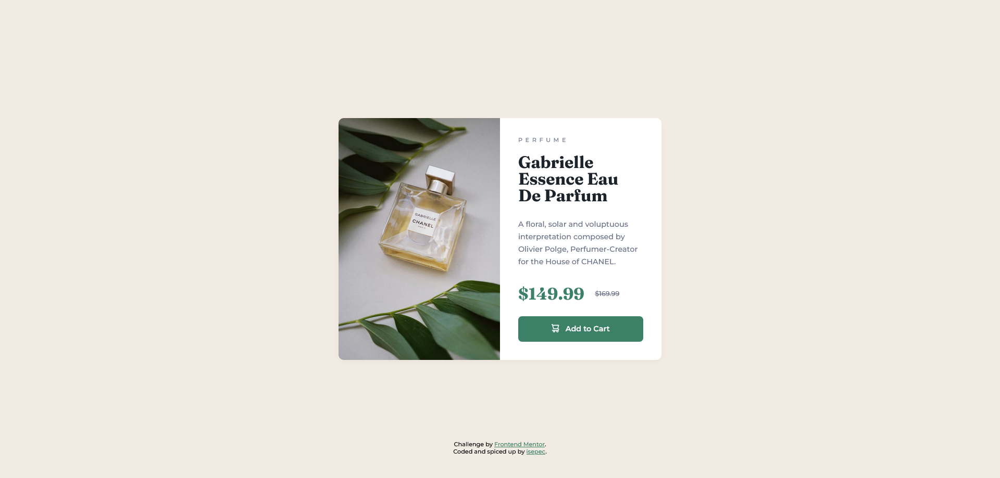

# Frontend Mentor - Product preview card component solution

This is a solution to the challenge on [Frontend Mentor](https://www.frontendmentor.io/).
<br>
Frontend Mentor challenges help you improve your coding skills by building realistic projects.

<br>

## Table of contents
  - [Screenshots](#screenshots)
  - [Live site](#live-site)
  - [My process](#my-process)
    - [Built with](#built-with)
    - [What I learned](#what-i-learned)
  - [Author](#author)

<br>

## Screenshots

Desktop



<br>

Mobile


<br>

Active states


<br>

Responsiveness


<br>

## Live site

✨ You can interact with my solution on its dedicated [live site](https://isepec.github.io/product-preview-card-component/).

<br>

## My process

### Built with

- Semantic HTML5 markup
- CSS custom properties
- Flex
- Responsive design

### What I learned

- To properly use ```transition``` without animating the unwanted.
- To use ```justify-content: space-between``` for spacing out ```flex``` elements.
- How ```rem``` & ```em``` units work.

<br>

## Author
- Github - [isepec](https://github.com/isepec)
- Frontend Mentor - [@isepec](https://www.frontendmentor.io/profile/isepec)